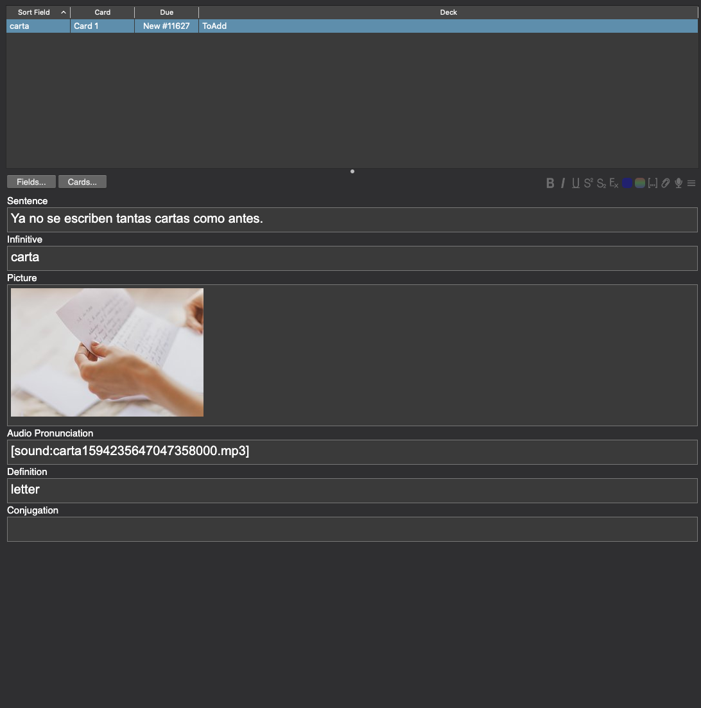

A command line tool to autogenerate Spanish-English Anki cards. Can be combined with an automation tool like Keyboard Maestro to quickly generate cards while reading Spanish content.

### Build

```
go build
```

### Usage

```
Usage of anki-autogen:
  -collectionsDir string
    	location of anki collections.media dir. (e.g. Users/username/Library/Application Support/Anki2/collection.media)
  -numberDefns int
    	number of cards to create (default 1: will create a card for the top usage).
  -outputFile string
    	csv output file name. import this file into anki.
  -word string
    	the word to create card for.
```

### Example
generate card for word `carta`
```
anki-autogen -word contar -outputFile cards.csv -collectionsDir "/MEDIA_DIR/collection.media"
```

results in `./cards.csv` (cards are appended to this file, so `anki-autogen` can be run repeatedly and all of the cards loaded via a single import)

```.csv
Ya no se escriben tantas cartas como antes.,carta,"",[sound:carta1594235647047358000.mp3],letter,
```

After importing into Anki


